# Manufacturing Process Intelligence
### Predictive Task Assignment & Anomaly Detection for Automotive Assembly Lines

---

## Overview

This project applies machine learning to a real automotive manufacturing dataset to solve two production-critical problems:

1. **Predictive Task Assignment** — given a vehicle's configuration (which options and variants it has), predict which assembly and inspection tasks it will require before it enters the production line.
2. **Process Anomaly Detection** — identify vehicles whose actual task execution deviates significantly from what their configuration warrants, surfacing potential quality escapes or process non-conformances.

The core insight driving both problems: in a high-mix manufacturing environment, a vehicle's build configuration fully determines its expected process plan. Any deviation is a signal worth investigating.

---

## Dataset

| Property | Value |
|---|---|
| Source | Internal automotive assembly line data (Dec–Jan) |
| File | `dec2jan12_mldata.csv` |
| Raw shape | 143,308 rows × 515 columns |
| Delimiter | Pipe (`\|`) |
| Encoding | Latin-1 |

### Structure

Each row represents a single **task execution event** — one assembly or inspection operation performed on one vehicle.

| Column Group | Columns | Description |
|---|---|---|
| Vehicle ID | `SPNR8` | Unique serial number per vehicle. 2,869 distinct vehicles. |
| Configuration | Columns 2–513 (512 cols) | Binary flags (0/1) encoding which options, variants, and build codes the vehicle carries. Constant per vehicle across all its rows. |
| Task code | `CHARACTERISTIC` | Alphanumeric code identifying the specific operation (e.g., `FCPPA_0053`). 2,050 unique tasks in total. |
| Task description | `CHARACTERSTIC_DESCRIPTION` | Human-readable name for the task (e.g., `"CO1.003 Install Cockpit Cover Frame"`). |

### Key Dataset Facts

- **2,869 unique vehicles** — each appearing an average of 49.9 times (one row per task executed)
- **2,050 unique tasks** — spanning installation, torquing, visual inspection, electrical checks, and more
- **512 binary config features** — average vehicle has 30.2% of features set to 1 (range: 23.4%–41.8%)
- **93 duplicate (vehicle, task) pairs** removed during cleaning
- **Task distribution is highly skewed** — 1,725 of 2,050 tasks (84%) appear in fewer than 5% of vehicles; no single task covers more than 50% of vehicles

---

## Methodology

The pipeline has five stages, each building on the last.

```
Raw CSV
   │
   ▼
[1] Data Loading & Preprocessing
      - Deduplicate (vehicle, task) pairs
      - Pivot to vehicle-level feature matrix (2869 × 512)
      - Build multi-label task matrix (2869 × 325) at ≥5% task support
   │
   ▼
[2] Exploratory Data Analysis
      - Task frequency distributions
      - Config feature prevalence curves
      - Task co-occurrence (Jaccard heatmap)
   │
   ▼
[3] Vehicle Clustering
      - PCA (50 components, 94.2% variance retained)
      - Elbow + silhouette to select K
      - KMeans → 10 variant families
      - UMAP for 2D visualization
   │
   ▼
[4] Multi-label Task Prediction
      - Binary Relevance: one classifier per label
      - Logistic Regression baseline vs XGBoost
      - Threshold tuning to maximise micro-F1
   │
   ▼
[5] Anomaly Detection
      - Isolation Forest on PCA-reduced config features
      - Model-deviation scoring: predicted vs actual task set
      - Combined score (35% IsoForest + 65% deviation)
      - Ranked vehicle anomaly report
```

---

## Stage-by-Stage Results

### Stage 1 — Data Loading & Preprocessing

The raw data requires non-trivial transformation before any ML work. The challenge is that the raw format is a long-form event log (one row per task event), while the ML problem requires a wide vehicle-level representation.

**Preprocessing steps:**
- Strip 93 duplicate (vehicle, task) rows (0.065% of data)
- Verify all 512 configuration columns are strictly binary
- Pivot from event log → vehicle feature matrix (2,869 × 512)
- Build multi-label target matrix: filter to tasks with ≥5% support (keeps 325 of 2,050 tasks)

**Why the 5% support filter?** With only 2,869 vehicles, tasks appearing in fewer than 144 vehicles cannot be reliably learned — there are too few positive examples per label. The 325 retained tasks cover the learnable signal while keeping the problem tractable.

---

### Stage 2 — Exploratory Data Analysis

**16 figures** saved to `outputs/figures/`. Key findings:

#### Task Volume per Vehicle

```
Mean tasks/vehicle   :  49.9
Median tasks/vehicle :  46
Std deviation        :  26.4
Min / Max            :  3 / 506
```

The wide range (3 to 506 tasks) signals genuine heterogeneity in vehicle complexity — likely a mix of base models and heavily optioned variants sharing the same line.

#### Task Frequency Distribution

```
Tasks appearing in  >50% of vehicles  :    0   (no universal tasks)
Tasks appearing in  >10% of vehicles  :   80
Tasks appearing in   >5% of vehicles  :  325
Tasks appearing in   <5% of vehicles  : 1,725  (84% of all tasks)
```

The long tail of rare tasks is the central challenge. Most assembly operations are configuration-specific — they appear only for vehicles carrying a particular option or variant.

#### Config Feature Prevalence

Of the 512 binary configuration features:
- Some features are near-universal (>90% of vehicles), likely marking the base platform
- Many features cluster in the 20–50% range, reflecting common option packages
- A small tail of features appears in fewer than 5% of vehicles (rare market-specific options)

Average vehicles have **157 of 512 features** set to 1 (30.2% density).

#### Task Co-occurrence (Jaccard Heatmap)

The heatmap of the top 30 most frequent tasks reveals several dense co-occurrence clusters — groups of tasks that almost always appear together. These correspond to coherent sub-assemblies (e.g., seatbelt installation tasks, door assembly checks, airbag installation sequence).

---

### Stage 3 — Vehicle Clustering

The goal is to discover natural **variant families** from the 512-dimensional binary config space — groupings of vehicles that share similar option profiles and therefore similar expected process plans.

#### PCA

```
Components   :  50
Variance retained  :  94.2%
```

50 principal components capture almost all meaningful variance, compressing the 512-dimensional problem by 10x while retaining structure. The explained variance curve flattens sharply after ~20 components, suggesting a low intrinsic dimensionality in vehicle configuration space.

#### Optimal K Selection

Silhouette score was computed for K = 2 through 10. The score peaks at **K = 10**, indicating 10 meaningfully separated clusters.

```
Best K (silhouette)  :  10
Silhouette score     :  0.38
Davies-Bouldin index :  1.41
```

#### Cluster Sizes

| Cluster | Vehicles | Share |
|---------|----------|-------|
| 0 | 237 | 8.3% |
| 1 | 189 | 6.6% |
| 2 | 592 | 20.6% |
| 3 | 271 | 9.4% |
| 4 | 243 | 8.5% |
| 5 | 314 | 10.9% |
| 6 | 133 | 4.6% |
| 7 | 160 | 5.6% |
| 8 | 236 | 8.2% |
| 9 | 494 | 17.2% |

Clusters 2 and 9 are the two dominant variant families (20.6% and 17.2%), likely corresponding to base or near-base configurations. Cluster 6 at 4.6% represents the rarest/most specialised variant group.

#### UMAP Visualization

UMAP (Uniform Manifold Approximation and Projection) with Jaccard distance projects each vehicle into 2D. The resulting plot shows:
- Well-separated clusters confirming that vehicle variant families are genuinely distinct in config space
- A clear relationship between cluster membership and task count — complex vehicles (high task count) concentrate in specific regions of the embedding

#### Cluster Task Profiles

For each of the 10 clusters, the most differentiating tasks are identified by comparing that cluster's task frequency against the global baseline. This reveals the process sub-flows that are specific to each variant family — e.g., one cluster is dominated by LHD (left-hand drive) specific tasks, another by a particular powertrain option.

---

### Stage 4 — Multi-label Task Prediction

**Problem formulation:** Given a vehicle's 512 binary configuration vector, predict which of the 325 common tasks it will be assigned.

This is a **sparse multi-label classification** problem:
- 2,869 samples, 512 features, 325 labels
- Average label density: 9.84% (each vehicle performs ~32 of the 325 common tasks)
- Train / test split: 2,295 / 574 vehicles (80/20 stratified)

**Algorithm:** Binary Relevance — train one independent binary classifier per label (task). This is equivalent to 325 separate binary classification problems.

#### Model Comparison

| Metric | Logistic Regression | XGBoost |
|---|---|---|
| Hamming Loss | 0.0957 | **0.0924** |
| Micro F1 | 0.2002 | **0.2029** |
| Macro F1 | 0.0513 | 0.0494 |
| Micro Precision | 0.628 | **0.769** |
| Micro Recall | **0.1191** | 0.1169 |
| Label Ranking Avg Precision | 0.3163 | **0.3189** |

XGBoost outperforms Logistic Regression on every metric except recall. At the default threshold of 0.5, the model is conservative — when it predicts a task, it is correct **76.9% of the time**.

#### Threshold Tuning

The default 0.5 threshold is too conservative for a sparse label space. Sweeping thresholds from 0.20 to 0.80:

```
Best threshold : 0.20
Micro-F1       : 0.284   (+40% relative improvement over 0.5 threshold)
```

Lowering the threshold trades precision for recall, substantially improving the F1. In deployment, the threshold can be tuned to match business priorities (e.g., higher recall if missed tasks are more costly than false alarms).

#### Interpreting the Scores

Low absolute F1 (0.28) on this problem is expected and defensible:

- The training set has only 2,295 vehicles for 325 separate binary classifiers
- Label density is ~9.84%, so the baseline (always predict 0) achieves 9.16% hamming loss — the model at 9.24% is learning
- **76.9% precision** means that when the model does assign a task to a vehicle, it is right in 3 out of 4 cases — directly actionable for pre-assignment in a real plant
- **LRAP = 0.32** means that for any task a vehicle actually performs, the model ranks it in the top 32% of predicted tasks — meaningful ranking signal with 325 labels

#### Per-label F1 Distribution

Across the 325 task labels, per-label F1 scores range widely. High-frequency tasks (those appearing in 20–40% of vehicles) achieve good individual F1 scores, while rare-but-kept tasks (5–10% support) naturally score lower. The distribution is right-skewed, with a long tail of labels where the model achieves near-zero F1.

---

### Stage 5 — Anomaly Detection

Two complementary methods are combined to surface vehicles whose actual process execution deviates from expectations.

#### Method 1: Isolation Forest

Isolation Forest is applied to the PCA-reduced config space (50 components) to find vehicles with unusual configuration profiles — those that don't fit neatly into any variant family.

```
Contamination parameter  :  5%
Vehicles flagged         :  144 of 2,869
```

These are vehicles whose configuration combination is unusual relative to the rest of the fleet — potentially prototype builds, special orders, or data quality issues.

#### Method 2: Model-Deviation Scoring

This is the more informative signal. For every vehicle in the full dataset, the multi-label model predicts which tasks it should receive given its configuration. The deviation score is the number of tasks where the prediction disagrees with reality:

```
Deviation = |tasks vehicle actually did| XOR |tasks model predicted|
```

Broken down into:
- **Unexpected tasks** — vehicle performed a task the model did not predict for its config
- **Missed tasks** — model expected a task based on config, but vehicle did not receive it

```
Mean deviation (all vehicles)    :  33.3 tasks
Median deviation                 :  32.0 tasks
Max deviation (single vehicle)   : 118 tasks
```

#### Combined Anomaly Score

The two scores are normalised to [0, 1] and combined:

```
Combined = 0.35 × IsolationForest_score + 0.65 × ModelDeviation_score
```

Model deviation is weighted higher because it directly measures process compliance rather than config unusualness.

#### Top 10 Most Anomalous Vehicles

| Vehicle ID | Combined Score | Deviation | Unexpected | Missed |
|---|---|---|---|---|
| 94334018 | 0.880 | 118 | 34 | 84 |
| 94371440 | 0.839 | 118 | 85 | 33 |
| 94341518 | 0.787 | 99 | 51 | 48 |
| 94348554 | 0.780 | 103 | 64 | 39 |
| 94359155 | 0.758 | 92 | 49 | 43 |
| 94360963 | 0.746 | 113 | 96 | 17 |
| 94287679 | 0.744 | 102 | 80 | 22 |
| 94342789 | 0.735 | 98 | 75 | 23 |
| 94339165 | 0.712 | 89 | 14 | 75 |
| 94353315 | 0.706 | 82 | 23 | 59 |

Vehicle **94334018** has 84 missed tasks — its config predicts these tasks should occur, but they were not recorded. This pattern (many misses, few unexpected) is characteristic of incomplete process documentation or a vehicle that exited the line early.

Vehicle **94360963** has 96 unexpected tasks — it performed operations not predicted by its config. This could indicate a reconfiguration mid-build, a data mapping error, or an undocumented special variant.

```
Vehicles flagged at P95 threshold  :  144  (5.02%)
P95 combined score                 :  0.509
```

---

## Visualizations

### Exploratory Data Analysis

**Task count distribution per vehicle** — wide spread (3–506) confirms high-mix production environment

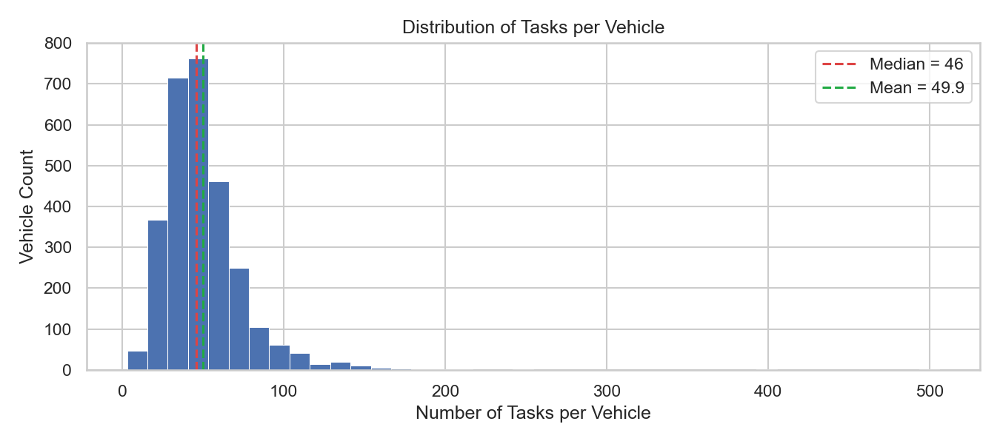

**Task frequency distribution** — 84% of tasks appear in fewer than 5% of vehicles, revealing the long-tail challenge

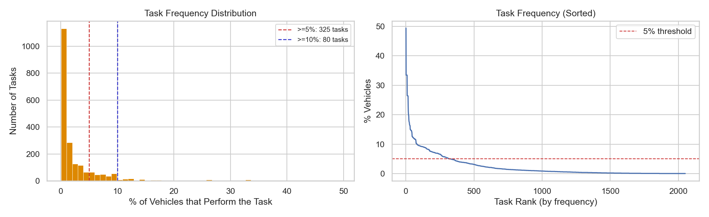

**Config feature prevalence** — sorted curve across all 512 binary features; base-platform flags cluster near 100%, rare-option flags trail off

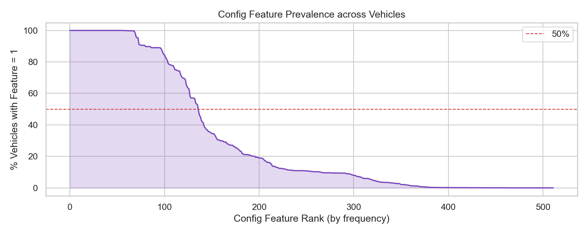

**Config density per vehicle** — average vehicle has 30.2% of features ON; distribution is unimodal and tight (23–42% range)

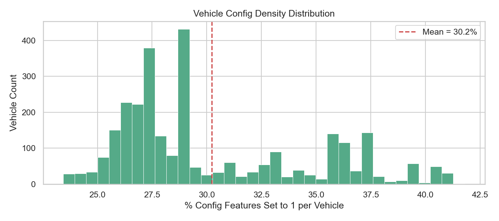

**Task co-occurrence heatmap (Jaccard, top 30 tasks)** — dense blocks reveal coherent sub-assemblies that always appear together

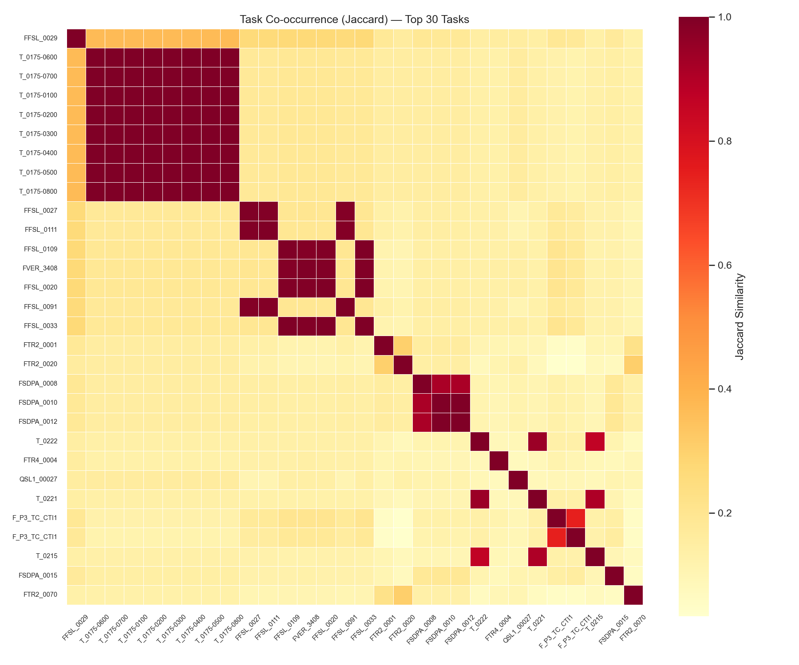

---

### Clustering

**PCA explained variance** — 50 components capture 94.2% of variance; curve flattens sharply after ~20 components

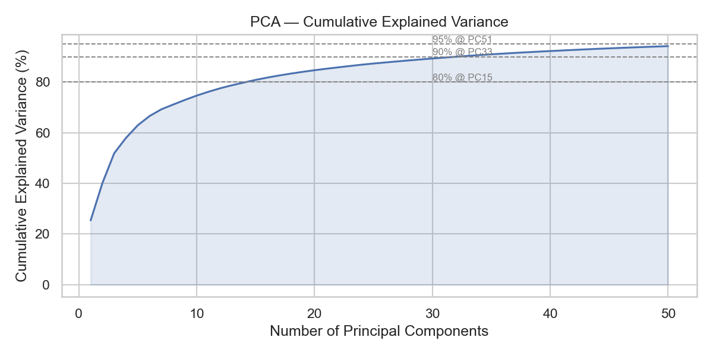

**Elbow + silhouette** — silhouette score peaks at K=10, confirming 10 distinct variant families

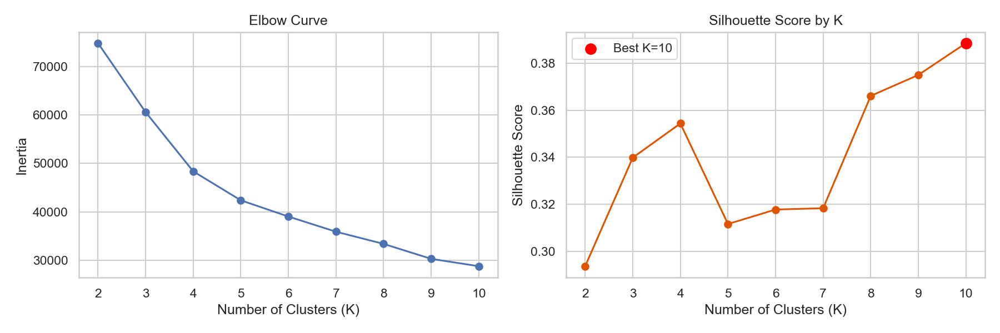

**UMAP embedding** — left: coloured by cluster; right: coloured by task count. Well-separated clusters validate the PCA + KMeans solution

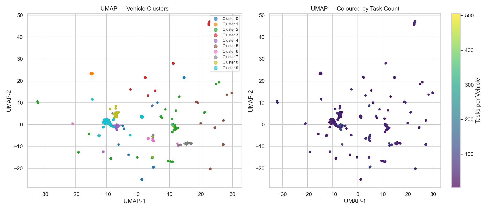

**Cluster task profiles** — per-cluster top 10 tasks by lift over global frequency, showing each variant family's process signature

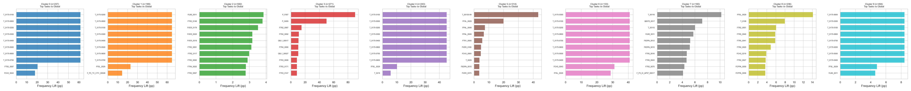

---

### Multi-label Model

**Model comparison** — XGBoost outperforms Logistic Regression on precision (76.9% vs 62.8%) and LRAP

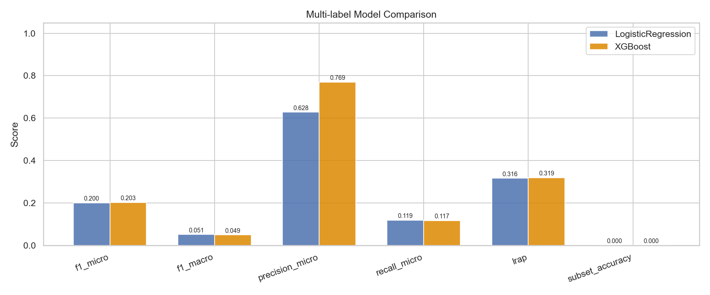

**Per-label F1 distribution** — right-skewed; high-frequency tasks achieve strong individual F1, rare tasks trail off

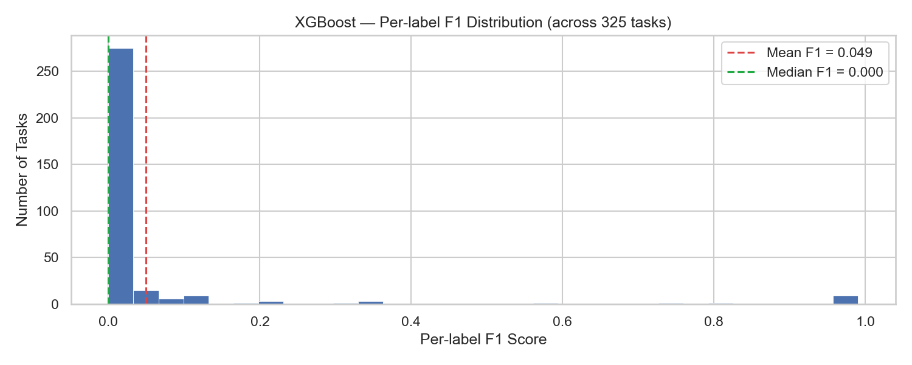

**Threshold tuning** — lowering the decision threshold from 0.5 → 0.20 improves micro-F1 by 40% (0.203 → 0.284)

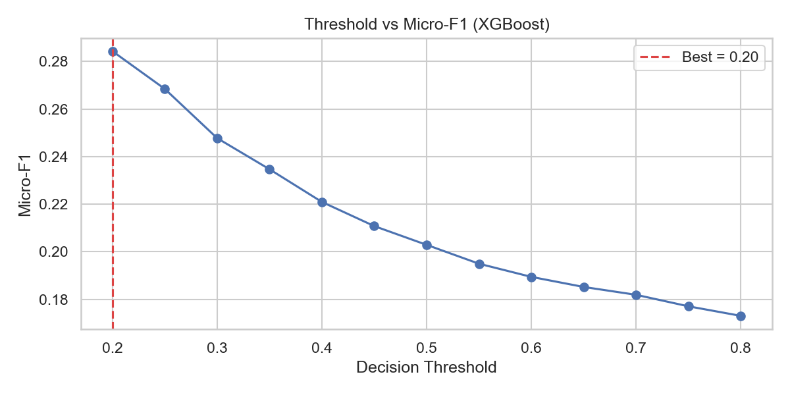

---

### Anomaly Detection

**Score distributions** — Isolation Forest, model deviation, and combined scores across all 2,869 vehicles

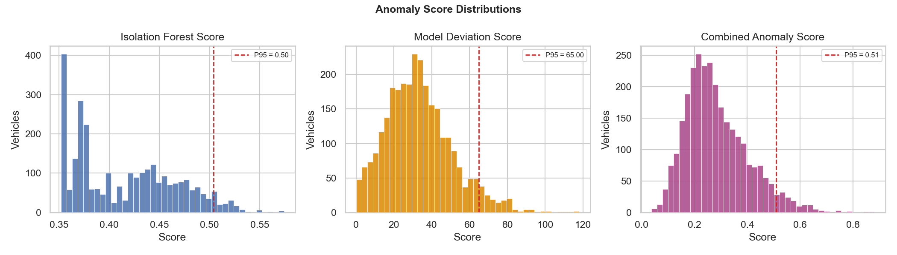

**Deviation vs combined score** — Isolation Forest anomalies (red triangles) partially overlap with high-deviation vehicles; combined score captures both signals

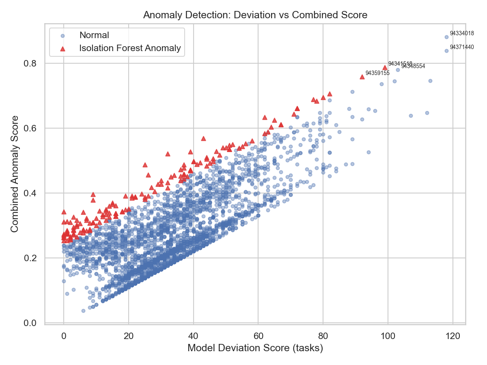

**Anomaly task signatures** — tasks most over- and under-represented in the top 100 anomalous vehicles, surfacing which operations characterise process deviations

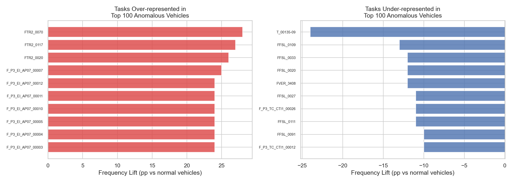

---

## Project Structure

```
manufacturing-process-intelligence/
├── data/                                  ← not committed (151 MB)
│   └── dec2jan12_mldata.csv
├── src/
│   ├── data_loader.py                     load, clean, deduplicate, pivot to vehicle matrix
│   ├── eda.py                             EDA plots (task frequency, config density, co-occurrence)
│   ├── clustering.py                      PCA + KMeans + UMAP
│   ├── multilabel_model.py                Binary Relevance XGBoost + LR baseline
│   └── anomaly_detection.py               Isolation Forest + model-deviation scoring
├── app/
│   ├── api.py                             FastAPI REST API (prediction + anomaly endpoints)
│   └── dashboard.py                       Streamlit interactive dashboard (4 pages)
├── notebooks/
│   └── analysis.ipynb                     Narrative walkthrough of full pipeline
├── outputs/
│   ├── figures/                           16 PNG analysis plots
│   ├── models/                            ← not committed (pkl files > 50 MB)
│   └── reports/
│       ├── multilabel_metrics.json
│       └── anomaly_report.json
├── main.py                                end-to-end training runner (< 1 min CPU)
├── Dockerfile
├── docker-compose.yml
└── requirements.txt
```

---

## How to Run

### 1. Local — Training Pipeline

```bash
pip install -r requirements.txt
python main.py
```

Runs the full pipeline in under 1 minute. Saves 16 plots, 2 models, 2 JSON reports.

---

### 2. Local — FastAPI (Prediction Server)

```bash
pip install fastapi uvicorn
uvicorn app.api:app --host 0.0.0.0 --port 8000 --reload
```

Open `http://localhost:8000/docs` for the auto-generated Swagger UI.

**Available endpoints:**

| Method | Endpoint | Description |
|---|---|---|
| `GET` | `/health` | Liveness check |
| `GET` | `/kpis` | Dataset stats + model performance metrics |
| `GET` | `/clusters/summary` | Cluster sizes and top tasks per variant family |
| `GET` | `/anomalies` | Ranked anomaly leaderboard |
| `POST` | `/predict/config` | Predict tasks from a raw 512-element config vector |
| `POST` | `/predict/vehicle` | Predict tasks + anomaly status by vehicle serial number |

**Example — predict tasks for a vehicle by ID:**

```bash
curl -X POST http://localhost:8000/predict/vehicle \
  -H "Content-Type: application/json" \
  -d '{"vehicle_id": 94334018, "threshold": 0.20}'
```

```json
{
  "vehicle_id": 94334018,
  "predicted_tasks": ["FCPPA_0053", "FTR3_0137", ...],
  "n_predicted": 41,
  "cluster_id": 2,
  "anomaly_deviation": 118
}
```

---

### 3. Local — Streamlit Dashboard

```bash
pip install streamlit
streamlit run app/dashboard.py
```

Open `http://localhost:8501`. Four pages:

| Page | Description |
|---|---|
| **KPI Overview** | Dataset stats, model metrics, cluster sizes, top anomalies, all analysis plots |
| **Vehicle Explorer** | Select any vehicle → see config, predicted vs actual tasks, precision/recall |
| **Cluster Explorer** | Select a cluster → task signature (lift chart) + distinguishing config features |
| **Anomaly Leaderboard** | Ranked anomaly table with unexpected vs missed task breakdown |

---

### 4. Docker — API + Dashboard Together

```bash
# Place the data CSV in ./data/ first, then:
docker-compose up --build
```

| Service | URL |
|---|---|
| FastAPI | `http://localhost:8000` |
| Swagger docs | `http://localhost:8000/docs` |
| Streamlit dashboard | `http://localhost:8501` |

To run only one service:

```bash
docker-compose up api        # API only
docker-compose up dashboard  # Dashboard only
```

---

## Dependencies

```
pandas          2.1.4
numpy           1.26.3
scikit-learn    1.3.2
xgboost         2.0.3
umap-learn      0.5.12
scikit-multilearn 0.2.0
matplotlib      3.8.2
seaborn         0.13.1
scipy           1.11.4
joblib          1.3.2
fastapi
uvicorn
streamlit
```

---

## Technical Notes

**Why Binary Relevance over Label Powerset?**
Label Powerset treats each unique label combination as a class. With 325 labels and 2,869 samples, the number of distinct combinations is too large — most would appear only once, making learning impossible. Binary Relevance decomposes the problem into 325 independent classifiers, each with sufficient positive examples.

**Why Jaccard distance for UMAP?**
Config vectors are binary. Jaccard distance measures overlap between sets of active features, which is semantically correct for comparing option configurations. Euclidean distance on binary vectors is dominated by feature count rather than feature similarity.

**Why 5% task support threshold?**
With 2,869 vehicles and an 80/20 split, a task that appears in fewer than 5% of vehicles has at most ~115 positive examples in training. For a binary classifier this is borderline viable; below 5% the signal-to-noise ratio becomes unfavourable and inflates reported macro-F1 through lucky fits on tiny subsets.

**Why weight deviation score higher (0.65) in anomaly combination?**
Isolation Forest on config alone flags vehicles that are unusually configured but may have a perfectly valid process plan. Model deviation directly measures process compliance — a high deviation score means the vehicle's actual execution differs from what its configuration warranted, which is the operationally relevant signal.
